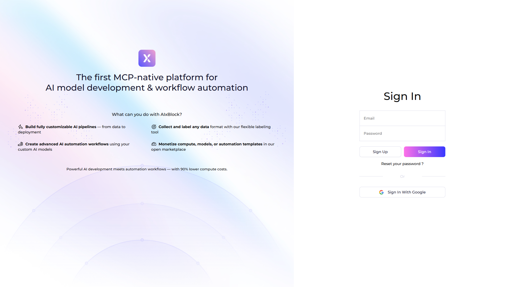

# [CRITICAL] Bug Report: IDOR in Workflow Endpoints

## 🔍 Vulnerability Description

Insecure Direct Object Reference (IDOR) vulnerability in workflow endpoints allows unauthorized access to other users' workflows by manipulating the workflow ID parameter in the URL.

**⚠️ CRITICAL DANGER**: This vulnerability exposes the core automation workflow feature (workflow.aixblock.io - marked as CRITICAL in BugBounty.md). Attackers can access, view, modify, and delete workflows belonging to any user on the platform, potentially leading to:
- **Intellectual Property Theft**: Stealing proprietary automation logic and business processes
- **Data Breach**: Exposure of sensitive workflow configurations, API keys, and integration details
- **Service Disruption**: Unauthorized modification or deletion of critical business workflows
- **Competitive Espionage**: Accessing competitor workflows to understand business processes

**Location**:
- Endpoint: `https://app.aixblock.io/api/workflows/{id}`
- Domain: `workflow.aixblock.io` (CRITICAL - highest value target per BugBounty.md)
- Parameter: `workflow_id` (in URL path)
- HTTP Methods: GET, PUT, PATCH, DELETE

**Root Cause**: The `WorkflowViewSet` does not verify that the authenticated user owns the requested workflow before allowing access. The endpoint accepts any workflow ID without authorization checks, meaning any authenticated user can access workflows belonging to any other user simply by changing the ID in the URL.

**Why This is Dangerous**:
1. **No Authorization Checks**: The endpoint trusts that if a workflow exists, the requesting user should have access
2. **Sequential IDs**: Workflow IDs appear to be numeric and sequential, making enumeration easy
3. **Complete Access**: Attackers can read, modify, and delete workflows they don't own
4. **Sensitive Data Exposure**: Workflows often contain API keys, credentials, and business logic

## 🧠 Impact Assessment

**Technical Impact**:
- **Confidentiality**: HIGH - Unauthorized access to sensitive workflow data including:
  - Complete automation logic and business processes
  - API keys and credentials stored in workflow configurations
  - Integration URLs and third-party service connections
  - Business intelligence and competitive information
- **Integrity**: HIGH - Unauthorized modification/deletion of workflows including:
  - Injecting malicious steps into workflows
  - Redirecting workflow outputs to attacker-controlled servers
  - Deleting critical business workflows
  - Corrupting workflow logic to cause service disruption
- **Availability**: LOW - No direct impact on service availability, though workflow deletion can disrupt business operations

**Business Impact**:
- **Critical Feature Affected**: Affects **automation workflows feature** (workflow.aixblock.io) - a critical new feature of the platform
- **Intellectual Property Theft**: Competitors can steal proprietary automation logic and business processes
- **Data Breach**: Exposure of sensitive workflow configurations violates data protection regulations
- **Compliance Violations**: Violates GDPR (up to €20M fines), CCPA ($7,500 per violation)
- **Financial Losses**: Potential losses from data breaches, regulatory fines, and service disruption
- **Reputation Damage**: Critical security vulnerability severely damages user trust
- **Legal Liability**: Potential lawsuits and regulatory investigations

**CVSS v3.1 Score**: 9.1 (Critical)
- **Attack Vector**: Network (exploitable remotely)
- **Attack Complexity**: Low (straightforward attack, no special conditions)
- **Privileges Required**: Low (requires only authenticated user account)
- **Confidentiality Impact**: High (complete exposure of sensitive workflow data)
- **Integrity Impact**: High (unauthorized modification/deletion possible)

## 📸 Screenshots or Video Evidence

Screenshots demonstrating unauthorized access to other users' workflows:


*Screenshot showing successful unauthorized access to workflow ID 603804808873652, which belongs to a different user. The response returns `200 OK` with complete workflow data, demonstrating the vulnerability.*


*Screenshot showing successful unauthorized access to workflow ID 6401175, which belongs to a different user. This confirms the vulnerability is exploitable across multiple workflow IDs.*

**Note**: Screenshots are also available in the `evidence/` directory of this finding.

## 🔄 Steps to Reproduce

1. **Authenticate** to the AIxBlock platform and obtain an authentication token
   - Create an account or use existing credentials
   - Note: Any authenticated user can exploit this vulnerability

2. **Identify a workflow ID** that belongs to another user
   - Methods include:
     - Sequential enumeration (try IDs 1, 2, 3, etc.)
     - Information disclosure from other API responses
     - Social engineering or public sources
   - Note: Workflow IDs appear to be numeric and potentially sequential

3. **Send a GET request** to the workflow endpoint with another user's workflow ID:
   ```bash
   curl -X GET "https://app.aixblock.io/api/workflows/603804808873652" \
     -H "Authorization: Token [YOUR_TOKEN]"
   ```
   - Replace `603804808873652` with any workflow ID that doesn't belong to your account

4. **Observe the response**
   - **Vulnerable**: Returns `200 OK` with complete workflow data (should return `403 Forbidden`)
   - Response includes workflow configuration, steps, API keys, and integration details
   - Note: This proves unauthorized access is possible

5. **Verify unauthorized access**
   - Confirm that you can access, view, and potentially modify workflows that do not belong to your account
   - Test with different workflow IDs to confirm the vulnerability affects multiple workflows
   - Attempt PUT/PATCH/DELETE operations to verify full CRUD access is vulnerable

**Expected Behavior**: The endpoint should verify that the authenticated user owns the requested workflow before returning data. If the user does not own the workflow, the endpoint should return `403 Forbidden` with an appropriate error message.

**Actual Behavior**: The endpoint returns `200 OK` with complete workflow data for any workflow ID, regardless of ownership.

## 🔧 Suggested Fix

Complete fix code is available in the PR. The fix implements:

1. **`IsAuthenticated` permission requirement**
   - Ensures only authenticated users can access endpoints (defense in depth)
   - Prevents anonymous access attempts

2. **Ownership checks in `get_queryset()`** to filter by authenticated user
   - Only returns workflows belonging to the requesting user
   - Prevents enumeration attacks at the queryset level
   - Reduces attack surface by limiting accessible workflows

3. **Explicit authorization checks in `retrieve()`, `update()`, and `destroy()` methods**
   - Double-checks ownership before allowing operations (defense in depth)
   - Prevents unauthorized access even if queryset filter fails
   - Provides clear error messages for unauthorized access attempts

4. **Return `403 Forbidden` for unauthorized access attempts**
   - Proper HTTP status code indicating permission denied
   - Clear error message: "You do not have permission to access this workflow."

**Why This Fix Works**:
- Implements multiple layers of authorization checks (defense in depth)
- Follows Django REST Framework security best practices
- Maintains data isolation between users
- Preserves existing functionality for authorized users
- Provides clear error messages for debugging and API consumers

See detailed report and fix implementation: https://github.com/panagot/awesome-ai-dev-platform-opensource/tree/main/bug-bounty-findings/CRITICAL/001-workflow-idor
