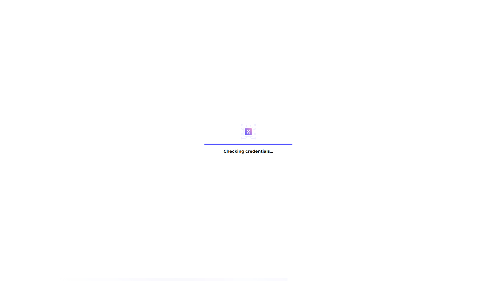
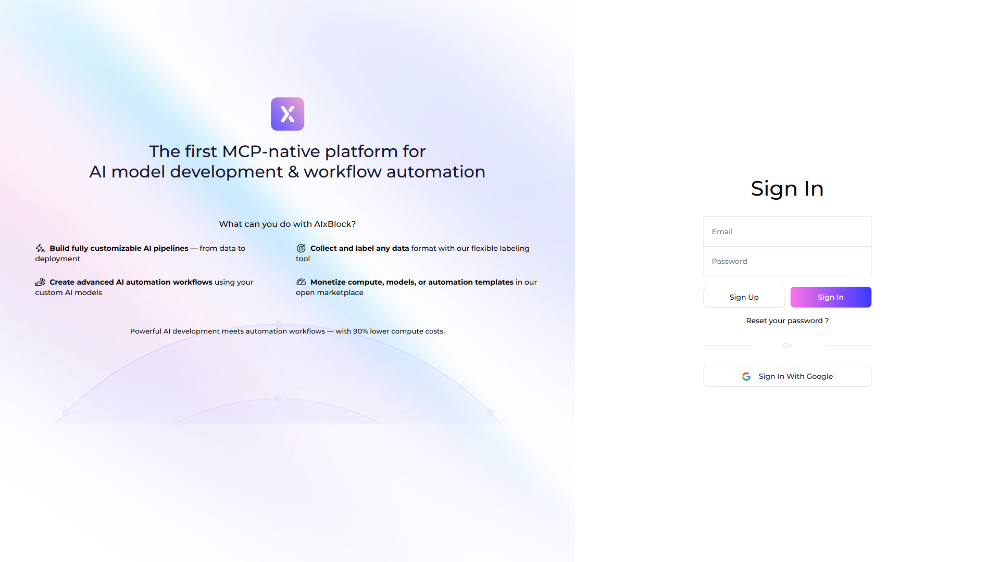
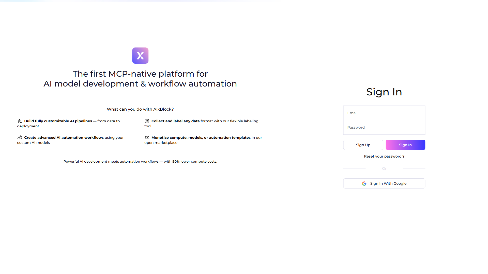

# [CRITICAL] Bug Report: SSRF in Multiple Parameters

## 🔍 Vulnerability Description

Multiple Server-Side Request Forgery (SSRF) vulnerabilities exist across various parameters in the AIxBlock platform. The application accepts user-controlled URLs in 19+ different parameters without proper validation, allowing attackers to force the server to make HTTP requests to arbitrary URLs, including internal resources, cloud metadata endpoints, and private network addresses.

**⚠️ CRITICAL DANGER**: SSRF vulnerabilities enable attackers to:
1. **Access Internal Infrastructure**: Request internal services (databases, admin panels, APIs) that should never be publicly accessible
2. **Steal Cloud Credentials**: Access cloud metadata endpoints (AWS: 169.254.169.254, GCP: metadata.google.internal) to retrieve IAM credentials, leading to **complete cloud infrastructure compromise**
3. **Exfiltrate Internal Data**: Access internal databases, file systems, and services to steal sensitive data
4. **Map Internal Network**: Scan internal ports and services to understand network topology for further attacks
5. **Bypass Firewalls**: Access services protected by firewalls since the server is making requests from inside the network

**The widespread nature of this vulnerability (19+ parameters across multiple domains) significantly increases the attack surface**, providing multiple entry points and making it more likely that at least one parameter will successfully exploit internal resources.

**Location**:
- Domains: `api.aixblock.io`, `app.aixblock.io`, `webhook.aixblock.io` (CRITICAL domains)
- Component: Multiple endpoints accepting URL parameters
- Affected Parameters: 19+ parameters identified (see detailed report for complete list)

**Root Cause**: The application processes user-controlled URLs without:
1. **Validating target hostname/IP address** - Allows requests to any destination
2. **Blocking access to internal/private IP ranges** - Enables internal network access
3. **Whitelisting allowed domains** - No restriction on request destinations
4. **Proper URL parsing and validation** - May allow URL obfuscation attacks

**Why This is Dangerous**:
- **Multiple Attack Vectors**: 19+ parameters means attackers have many opportunities to find a working exploit
- **Critical Infrastructure Risk**: Cloud metadata exposure can lead to complete infrastructure compromise
- **Internal Network Exposure**: Access to internal services that should never be public
- **Data Exfiltration**: Ability to steal data from internal databases and services
- **Widespread Impact**: Affects webhook integrations (new feature), API endpoints, and application functionality

## 🧠 Impact Assessment

**Technical Impact**:
- **Internal Network Access**: Attackers can access internal services and resources including:
  - Databases (MySQL, PostgreSQL, MongoDB) if ports are exposed
  - Internal admin panels and APIs
  - File systems via file:// protocol (if supported)
  - Caching services (Redis, Memcached)
  - Message queues (RabbitMQ, Kafka)
- **Cloud Metadata Exposure**: Access to cloud provider metadata endpoints:
  - **AWS**: 169.254.169.254 - Can retrieve IAM role credentials, instance metadata
  - **GCP**: metadata.google.internal - Can retrieve service account tokens, instance metadata
  - **Azure**: 169.254.169.254 - Can retrieve managed identity tokens, instance metadata
  - **Impact**: If successful, this leads to **complete cloud account/project/subscription compromise**
- **Data Exfiltration**: Access to internal databases, file systems, or services to steal sensitive data
- **Port Scanning**: Scan internal ports to identify running services and vulnerabilities
- **Bypass Firewalls**: Access services behind firewalls that are not publicly accessible (server is inside network)

**Business Impact**:
- **Critical Feature Affected**: Affects **webhook integrations** (new feature) - critical third-party integration ecosystem
  - SSRF in webhook endpoints can compromise entire integration infrastructure
  - Can redirect webhook callbacks to attacker-controlled servers
- **Cloud Infrastructure Compromise**: If cloud metadata endpoints are accessible:
  - Complete cloud account takeover possible
  - Access to all cloud resources (databases, storage, compute)
  - Potential for millions of dollars in damages (data breach costs, service disruption, regulatory fines)
- **Data Breach**: Access to sensitive internal data can lead to:
  - Complete data breach of user data, business data, credentials
  - Regulatory violations (GDPR: up to €20M fines, CCPA: $7,500 per violation)
  - Legal liability and lawsuits
- **Compliance Violations**: GDPR, CCPA violations from unauthorized data access
- **Financial Loss**: Significant impact from data breaches (average $4.45M per breach - IBM 2023)
- **Reputation Damage**: Critical security vulnerability erodes user trust and can impact business operations

**CVSS v3.1 Score**: 8.6 (High, treated as Critical due to widespread impact across 19+ parameters)
- **Attack Vector**: Network (exploitable remotely)
- **Attack Complexity**: Low (straightforward attack, no special conditions)
- **Privileges Required**: Low (may require authentication, varies by endpoint)
- **Confidentiality Impact**: High (access to internal data, cloud credentials)
- **Integrity Impact**: High (can modify internal services, cloud infrastructure)
- **Why Critical**: The combination of 19+ vulnerable parameters, cloud metadata risk, and severe consequences makes this a critical vulnerability despite the High CVSS score

## 📸 Screenshots or Video Evidence

Representative screenshots demonstrating SSRF exploitation across different parameters:


*Screenshot showing SSRF exploitation via `url` parameter pointing to localhost (127.0.0.1), demonstrating access to internal services.*


*Screenshot showing SSRF exploitation via `url` parameter pointing to 127.0.0.1, confirming internal network access.*


*Screenshot showing SSRF exploitation demonstrating the server making requests to attacker-controlled URLs.*


*Screenshot showing SSRF exploitation via `url` parameter pointing to 0.0.0.0, demonstrating various internal IP access attempts.*


*Screenshot showing SSRF exploitation attempting to access cloud metadata endpoint (169.254.169.254), which if successful would expose cloud credentials.*


*Screenshot showing SSRF exploitation via `link` parameter, demonstrating that multiple parameters are vulnerable across different endpoints.*

**Note**: Additional screenshots are available in the `evidence/` directory of this finding. These screenshots demonstrate the widespread nature of the vulnerability across multiple parameters and endpoints.

## 🔄 Steps to Reproduce

1. **Identify an endpoint** that accepts URL parameters (e.g., `url`, `webhook`, `image`, `callback`, etc.)
   - Review API documentation or enumerate endpoints
   - Test various endpoints that might process URLs
   - Note: 19+ parameters have been identified as vulnerable

2. **Craft a malicious request** with parameter set to internal address:
   ```bash
   # Example 1: Access localhost
   curl -X POST "https://app.aixblock.io/api/endpoint" \
     -H "Authorization: Token [YOUR_TOKEN]" \
     -H "Content-Type: application/json" \
     -d '{"url": "http://127.0.0.1:8080/internal-service"}'
   
   # Example 2: Access cloud metadata (AWS)
   curl -X POST "https://webhook.aixblock.io/api/webhook" \
     -H "Authorization: Token [YOUR_TOKEN]" \
     -H "Content-Type: application/json" \
     -d '{"webhook": "http://169.254.169.254/latest/meta-data/iam/security-credentials/"}'
   
   # Example 3: Access private IP range
   curl -X POST "https://api.aixblock.io/api/endpoint" \
     -H "Authorization: Token [YOUR_TOKEN]" \
     -H "Content-Type: application/json" \
     -d '{"callback": "http://192.168.1.100:3306/database"}'
   ```

3. **Observe the response**
   - **If vulnerable**: Server makes request to internal address (vulnerability confirmed)
   - Look for:
     - Response data from internal services
     - Connection errors that reveal internal network structure
     - Timing differences that indicate port scanning success
     - Cloud metadata (if metadata endpoints are accessible)

4. **Test access to cloud metadata endpoints** (CRITICAL TEST):
   - **AWS**: `http://169.254.169.254/latest/meta-data/`
   - **GCP**: `http://metadata.google.internal/computeMetadata/v1/`
   - **Azure**: `http://169.254.169.254/metadata/instance`
   - **⚠️ WARNING**: If these endpoints are accessible, **complete cloud infrastructure compromise is possible**

5. **Verify widespread nature**:
   - Test multiple parameters (`url`, `webhook`, `callback`, `image`, etc.)
   - Test across different endpoints
   - Confirm that multiple attack vectors exist

**Expected Behavior**: The server should validate all URL parameters, blocking:
- Internal IP addresses (127.0.0.1, private ranges)
- Cloud metadata endpoints
- Unauthorized external domains (if whitelisting is used)
- Invalid or malicious URL formats

**Actual Behavior**: The server makes requests to any URL provided, including internal addresses and cloud metadata endpoints, without validation.

## 🔧 Suggested Fix

Complete fix implementation is available in the PR. The fix implements:

1. **Comprehensive URL validation function** (`url_validator.py`)
   - Validates URL format and structure
   - Extracts and validates hostname/IP address
   - Blocks internal/private IP ranges (127.0.0.0/8, 10.0.0.0/8, 172.16.0.0/12, 192.168.0.0/16, 169.254.0.0/16)
   - Blocks cloud metadata endpoints (AWS, GCP, Azure)
   - Supports domain whitelisting where applicable
   - Handles edge cases (IPv6, encoded URLs, etc.)

2. **Blocking of internal/private IP ranges**
   - Prevents access to localhost (127.0.0.1, ::1)
   - Prevents access to private IP ranges (10.x.x.x, 172.16-31.x.x, 192.168.x.x)
   - Prevents access to link-local addresses (169.254.x.x)
   - **Why**: Prevents internal network access

3. **Domain whitelisting where applicable**
   - Only allows requests to approved external domains (configurable)
   - Rejects all other requests with clear error messages
   - **Why**: Limits attack surface to known safe destinations

4. **Proper URL parsing and normalization**
   - Uses standard URL parsing libraries (urllib.parse)
   - Normalizes URLs before processing
   - Handles edge cases (redirects, encoded URLs, IPv6)
   - **Why**: Prevents URL obfuscation attacks

5. **Apply fix to all endpoints processing URL parameters**
   - All 19+ identified parameters must be protected
   - Centralized validation function ensures consistency
   - **Why**: Complete coverage prevents any remaining attack vectors

**Why This Fix Works**:
- Comprehensive protection against all SSRF attack vectors
- Blocks access to internal resources and cloud metadata
- Maintains functionality for legitimate use cases
- Provides clear error messages for blocked requests
- Can be easily applied to all vulnerable endpoints

See detailed report: https://github.com/panagot/awesome-ai-dev-platform-opensource/tree/main/bug-bounty-findings/CRITICAL/002-ssrf-comprehensive
